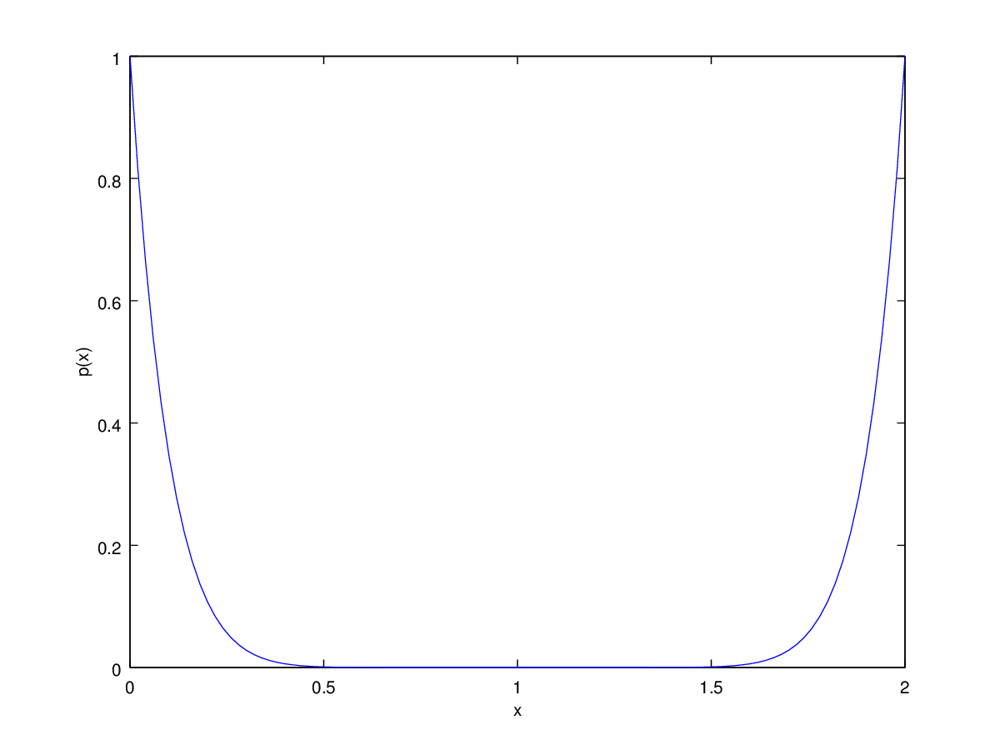
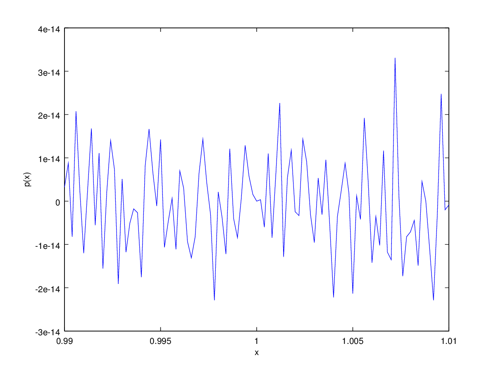
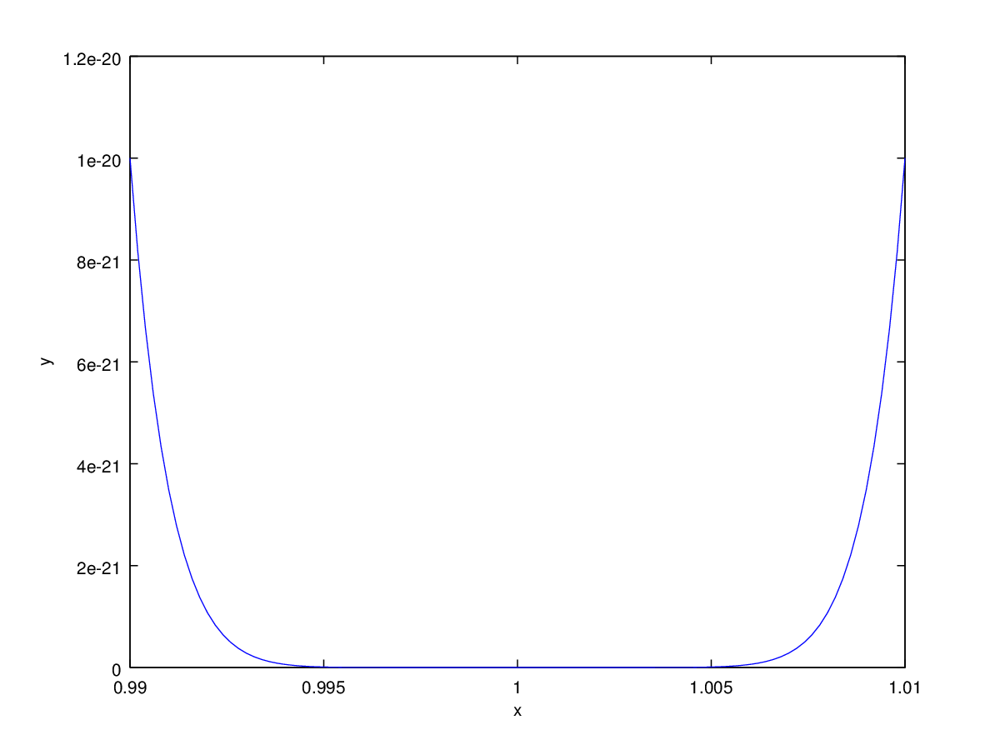
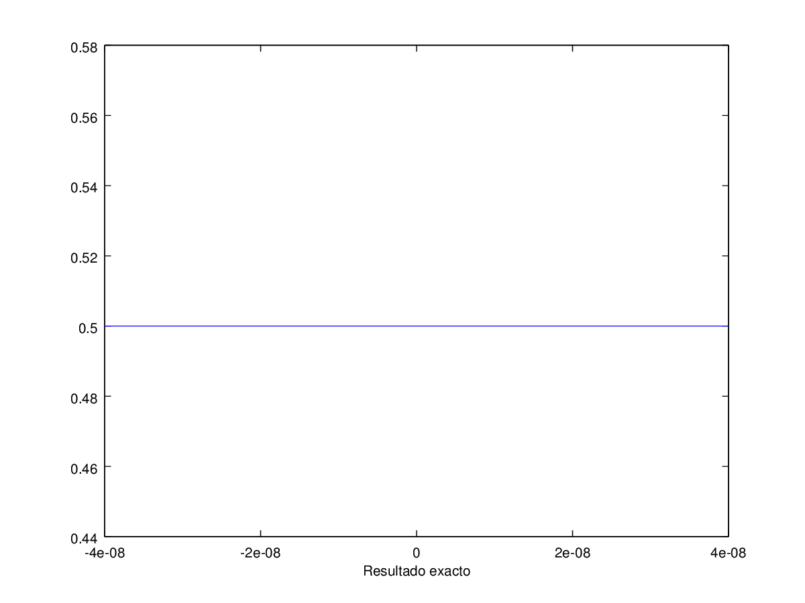
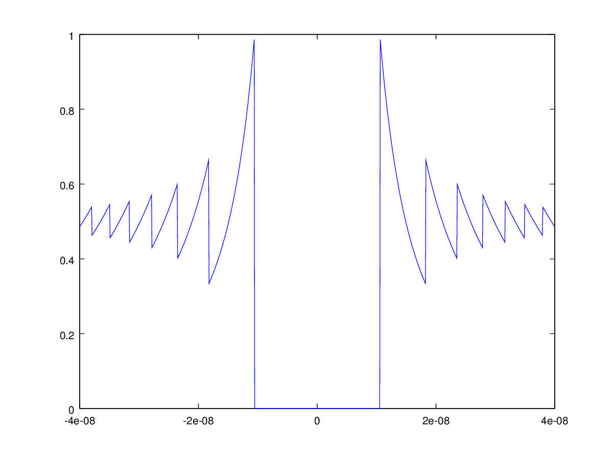

<h2>Table of Contents</h2>

<ul>
<li><a href="#sec-1">1. Representación Interna</a></li>
<li><a href="#sec-2">2. Otras cantidades definidas por el <b>IEEE 754</b></a></li>
<li><a href="#sec-3">3. Ejemplos de problemas con aritmética de punto flotante</a>
<ul>
<li><a href="#sec-3-1">3.1. Polinomios</a></li>
<li><a href="#sec-3-2">3.2. Conmutatividad de las raices cuadradas</a></li>
<li><a href="#sec-3-3">3.3. Cancelación catastrófica</a></li>
<li><a href="#sec-3-4">3.4. Ley Asociativa</a></li>
</ul>
</li>
</ul>

# Representación Interna

En `GNU/Octave` los cálculos son realizados siguiendo el estándar de la **IEEE**, es decir utilizan doble precisión.
Para poder ver la representación interna, le pediremos a `octave`  que lo muestre en `hexadecimal`.

    format hex;
    x = 2;
    ans = x

    ans = 4000000000000000

# Otras cantidades definidas por el **IEEE 754**

    format long
    ans = 1 / 0

    warning: division by zero
    ans = Inf

    1 / Inf

    ans = 0

Los cómputos de cantidades indeterminadas producen `NaN`:

    0*Inf

    ans = NaN

    0/0

    warning: division by zero
    ans = NaN

    Inf/Inf

    ans = NaN

# Ejemplos de problemas con aritmética de punto flotante

## Polinomios

Veamos que pasa si queremos dibujar el polinomio \(p(x) = (1-x)^{10}\) en la región \(0 \leq x \leq 2\):

    x = linspace(0, 2, 101);
    c = [1, -10, 45, -120, 210, -252, 210, -120, 45, -10, 1];
    p = polyval(c,x);
    plot(x,p);
    xlabel('x'), ylabel('p(x)');
    print -dpng pol10a.png;
    ans = "pol10a.png"

Todo normal hasta aquí, ¿Qué pasa si hacemos *zoom* a la región \(0,99 \leq x \leq 1.01\)?

    x = linspace(0.99, 1.01, 101);
    p = polyval(c,x);
    plot(x,p);
    xlabel('x'), ylabel('p(x)');
    print -dpng  pol10b.png;
    ans = "pol10b.png"

Contrasta esto con la versión normal del polinomio \(p(x)\):

    p = (1 -x).^(10);
    plot(x,p);
    xlabel('x'), ylabel('y');
    print("pol10c", "-dpng");
    ans = "pol10c.png"

## Conmutatividad de las raices cuadradas

    x = 1:0.25:3.75;
    n = 100
    t = x;
    for i = 1:n
      t = sqrt(t);
    end

    for i = 1:n
      t = t  .* t;
    end
    disp(sprintf('x       t        x-t '))
    for k = 1:10
      disp(sprintf(' %7.4f  %7.4f  %7.4f', x(k), t(k), x(k)-t(k)))
    end

    n =  100
    > > octave> > > octave> x       t        x-t
    > >   1.0000   1.0000   0.0000
      1.2500   1.0000   0.2500
      1.5000   1.0000   0.5000
      1.7500   1.0000   0.7500
      2.0000   1.0000   1.0000
      2.2500   1.0000   1.2500
      2.5000   1.0000   1.5000
      2.7500   1.0000   1.7500
      3.0000   1.0000   2.0000
      3.2500   1.0000   2.2500

## Cancelación catastrófica

La *cancelación catastrófica* ocurre cuando  números pequeños son calculados
de números grandes los cuales son a su vez sujetos a un error de redondeo.

Veamos la gráfica de

\begin{equation}
f(x) = \frac{1-\cos x}{x^2}
\end{equation}

alrededor de la región \(-4\times 10^{-8} \leq x \leq 4\times 10^{-8}\):

Pero el resultado obtenido con números flotantes es:

    x = linspace(-4e-8,4e-8, 1000);
    y = (1-cos(x))./x.^2;
    plot(x,y);
    print -dpng catastrofico.png
    ans = "catastrofico.png"

Analicemos por pasos, para el caso \(x = 1 \times 10^{-8}\)

    x = 1.1e-8

    x =    1.10000000000000e-08

    1 - cos(x)

    ans =    1.11022302462516e-16

    (1-cos(x))./(x.^2)

    ans =  0.917539689772857

Esto representa un error relativo cercano al \(80\) %.

Esta cancelación catastrófica se puede arreglar usando las identidades
trigonométricas y reescribiendo la ecuación como:

\begin{equation}
g(x) = \frac{2 \sin^2 \left( x/2 \right)}{x^2}
\end{equation}

(Con esta ecuación se realizó la primera gráfica).

Dicho de otra manera el **algoritmo** \(f(x)\) es *inestable*, y el **algoritmo** \(g(x)\) es *estable*.

## Ley Asociativa

Consideremos la serie armónica:

\begin{equation}
S = \sum^N_{i=1} \frac{1}{i}
\end{equation}

Siendo \(N = 10^6\), calculamos usando la representación "exacta" (a 20 decimales, usando `python`):

    from sympy.core.numbers import Float
    N = 1000000
    s = Float(0,20)
    for i in range(1, N):
        s = s + 1.0/i
    return s

    14.392726722865723583

En cambio, usando aritmética **IEEE** ( en `octave` ):

    N=1000000
    format long e
    s = 0;
    for i=1:N
      s = s + 1.0/i;
    end
    ans = s

    14.39272672286499

Las últimas cifras son diferentes a las del resultado "exacto". Pero observa lo siguiente:

    N=1000000
    format long e
    s = 0;
    for i=N:-1:1
      s = s + 1.0/i;
    end
    ans = s

    14.39272672286577

La razón es la siguiente: *Si sumamos un número pequeño a un número grande, los bits menos significativos del pequeño se perderán.*
Por lo que es mejor empezar con los números pequeños al principios y los grandes al final. El problema de esto, es que el proceso de
*ordenamiento* significa mucho trabajo computacional que quizá no valga la pena.
